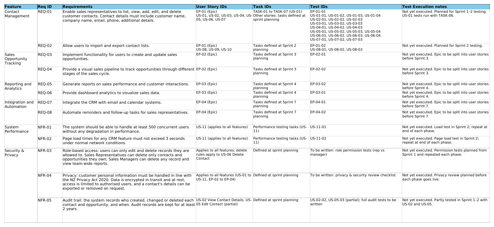
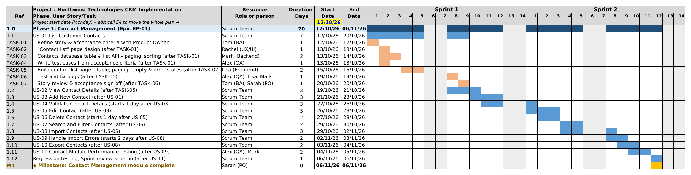

# Northwind Technologies – CRM Implementation
### Business Analysis Case Study

A complete business analysis case study for a CRM implementation at Northwind Technologies, a fictitious company. The project follows the full BA process: from the business problem to requirements, user stories, delivery planning, traceability and risk management.

> **Note:** Northwind Technologies and all people, dates and estimates in this project are fictitious. This case study was completed to practise and demonstrate business analysis skills.

---

##  Business Problem

Northwind's sales team keeps customer contacts in separate spreadsheets and email inboxes. This causes:

- Duplicate and out-of-date customer records
- No clear view of the sales pipeline
- Missed meetings and customer follow-ups
- No easy way for Sales Managers to report on team performance

**Proposed solution:** a central CRM system with contact management, sales opportunity tracking, reporting dashboards, and Outlook email and calendar integration with automated reminders.

---

##  Project Objectives

| Objective | Success Measure (illustrative) |
|---|---|
| Accurate contact data | Duplicate contacts below 2% three months after go-live |
| Pipeline visibility | All open opportunities tracked in the CRM by sales stage |
| Faster reporting | Weekly sales report produced in under 10 minutes |
| Fewer missed follow-ups | Automatic reminders for all meetings and due tasks |

---

##  Project at a Glance

| Item | Details |
|---|---|
| Delivery method | Scrum (2-week sprints) |
| Timeline | 8 sprints + project closure (81 working days) |
| Requirements | 13 (8 functional, 5 non-functional) |
| Epics | 4 |
| User stories | 11 (Contact Management epic) |
| Acceptance criteria | 35 (each one is also a test case) |
| Risks identified | 6 |

---

##  Project Files

| File | Description |
|---|---|
| [ Workbook (PDF)](Northwind_CRM_Project_Workbook.pdf) | Read the full workbook in your browser |
| [ Workbook (Excel)](Northwind_CRM_Project_Workbook.xlsx) | Download the original file with working formulas |

### What's inside the workbook

| Tab | Purpose |
|---|---|
| **Project Overview** | Business problem, objectives, scope, stakeholders and assumptions |
| **Requirements** | Functional (REQ) and non-functional (NFR) requirements, including performance, security, privacy and audit |
| **EPICS** | Four epics, one per feature, with high-level acceptance criteria |
| **User Stories** | 11 user stories with acceptance criteria, MoSCoW priority and story points |
| **Roadmap** | 17-week high-level delivery plan by phase |
| **Gantt Chart** | Detailed schedule with owners, dependencies and milestones; dates calculated automatically with formulas |
| **Traceability Matrix** | Links every requirement to epics, user stories, tasks and test cases |
| **Risk Log** | Delivery risks scored by likelihood × impact, with mitigation and owner |

---

##  Screenshots

### Traceability Matrix
Every requirement is linked to the work that delivers it and the test that proves it.

### Gantt Chart – Phase 1 (Sprints 1–2)
Formula-driven schedule showing phases, user stories, tasks, owners and milestones.

---

##  Business Analysis Techniques Used

- **Requirements elicitation and documentation:** functional and non-functional requirements with unique IDs
- **User stories:** written in "As a… I want… so that…" format and split using the INVEST principles
- **Acceptance criteria:** written in two styles (rule-based and Given / When / Then), covering error and edge cases
- **Prioritisation and estimation:** MoSCoW priority and story points
- **Requirements traceability:** requirement → epic → user story → task → test case
- **Agile delivery planning:** roadmap, sprint-based Gantt chart, dependencies and milestones
- **Stakeholder analysis:** project team roles and responsibilities
- **Risk management:** risk log with scoring, mitigation and ownership

---

##  Key Decisions

- **Progressive elaboration:** only the first epic (Contact Management) is broken down into user stories and tasks. Later epics are split just before their sprint, as in real Scrum projects.
- **Unhappy paths as separate stories:** contact validation (US-04) and import errors (US-09) are their own stories, so error handling is planned and tested, not forgotten.
- **One acceptance criterion = one test case:** test IDs match acceptance criteria IDs, which keeps traceability simple and clear.
- **Consistent ID system:** REQ / NFR (requirements), EP (epics), US (user stories), US-xx-yy (acceptance criteria and tests), TASK (tasks).

---

##  Lessons Learned

- **No buffer in the plan:** the 11 Contact Management stories only fit in Sprints 1–2 if they run in parallel. In a real project, I would add buffer time or move lower-priority stories to a later sprint.
- **Holidays not included:** NZ public holidays and the Christmas break fall inside the timeline, so the real end date would be later.
- **Plans change in Agile:** the roadmap is high level. In Scrum, later phases are re-planned at each sprint planning, so the Gantt chart would be updated as the project progresses.

---

##  Tools

Microsoft Excel: formulas (WORKDAY), conditional formatting, data structuring

---

